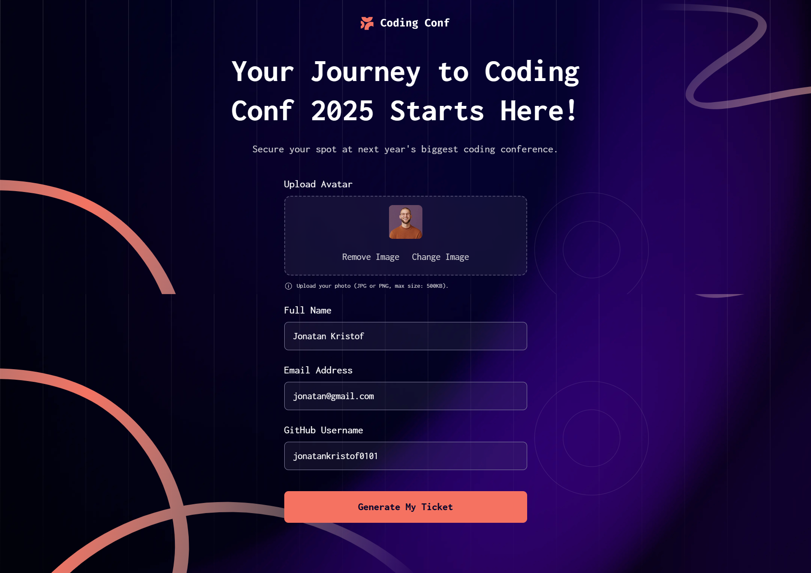
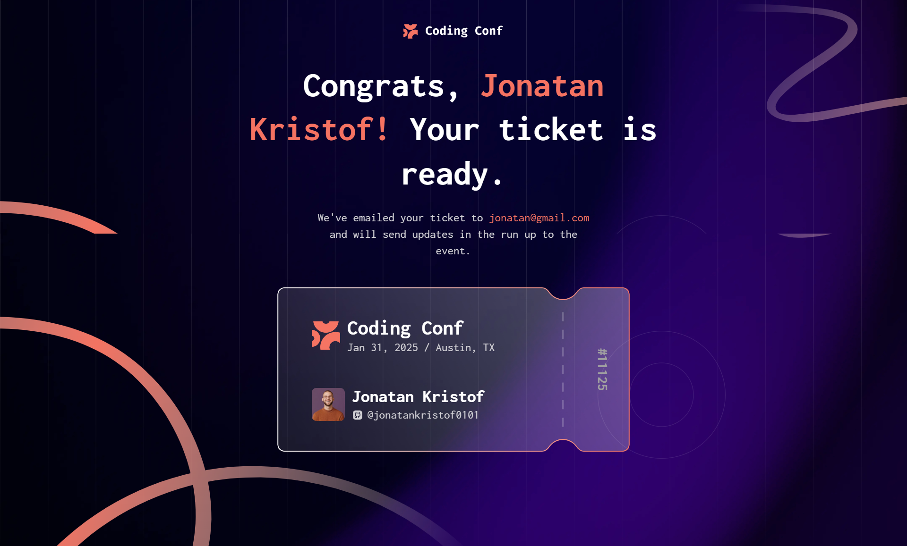

# Frontend Mentor - Conference Ticket Generator solution

This is a solution to the [Conference Ticket Generator challenge on Frontend Mentor](https://www.frontendmentor.io/challenges/conference-ticket-generator-oq5gFIU12w). Frontend Mentor challenges help you improve your coding skills by building realistic projects.

## Table of contents

- [Overview](#overview)
  - [The challenge](#the-challenge)
  - [Screenshot](#screenshot)
  - [Links](#links)
- [My process](#my-process)
  - [Built with](#built-with)
  - [What I learned](#what-i-learned)
  - [Continued development](#continued-development)
- [Author](#author)

## Overview

### The challenge

Users should be able to:

- Complete the form with their name, email address, and GitHub username
- Receive form validation messages if:
  - Any field is missed
  - The email address is not formatted correctly
- Upload an avatar image
- See a preview of the avatar image they upload
- Remove the uploaded image
- Generate a custom ticket once the form is submitted, personalized with their details and avatar
- View the optimal layout depending on their device's screen size
- See hover and focus states for all interactive elements

### Screenshot

### Links

- Solution URL: [Add your solution URL here](https://your-solution-url.com)
- Live Site URL: [Add your live site URL here](https://your-live-site-url.com)

## My process

### Built with

- Semantic HTML5 markup
- Tailwind CSS
- Flexbox
- Mobile-first workflow
- [React](https://reactjs.org/) - JS library
- [Vite](https://vitejs.dev/) - Build tool

### What I learned

Some things I want to keep working on:

- Writing DRY React code from the start instead of refactoring repetition after the fact (e.g. controlled form inputs sharing a single `onChange` handler via the input's `name` attribute)
- Double-checking that every `<label htmlFor>` has a matching `id` on its input
- Splitting a component into smaller ones as soon as it starts handling more than one responsibility

### Continued development

Next steps for future projects:

- Using TypeScript in my next projects (this one was built in plain JavaScript)
- Practice breaking down UI into smaller, single-responsibility components before writing code, not after a review points it out

## Author

- Frontend Mentor - [@Ismaellerakotoson](https://www.frontendmentor.io/profile/Ismaellerakotoson)
- GitHub - [@Ismaellerakotoson](https://github.com/Ismaellerakotoson)